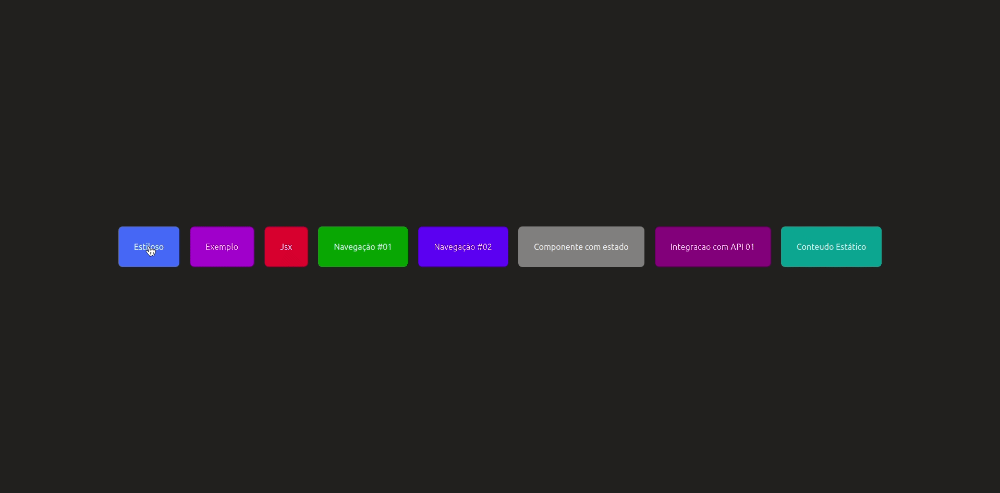

<h1 align="center"> NextJs & ReactJs Aulão 01 </h1> 



## Primeiro aulão de nextJs e ReactJs
Neste aulão foi dado um passo inicial nos conceitos base do NextJs, fazendo um resumão dos beneficios da aplicação.


## Dependências 
 - next: 11.0.1
 - react: 17.0.2
 - react-dom: 17.0.2

## Inicie a aplicação
Primeiro, rode em modo de desenvolvimento:

```bash
npm run dev
# or
yarn dev
```

Abra [http://localhost:3000](http://localhost:3000) com seu navegador parar ver a aplicação.
