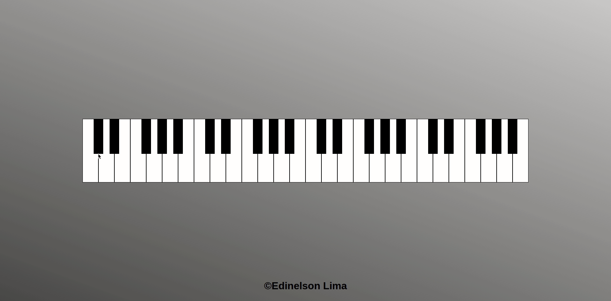

<h1 align="center"> Teclado Musical </h1>

 
<h2 align="center"> Tecnologias usadas </h2>

  
  
  

 

### Teclado em javascript
Desenvolvi esse teclado musical interativa para melhorar meus conceitos sobre os **eventos** e o **DOM** no javascript
