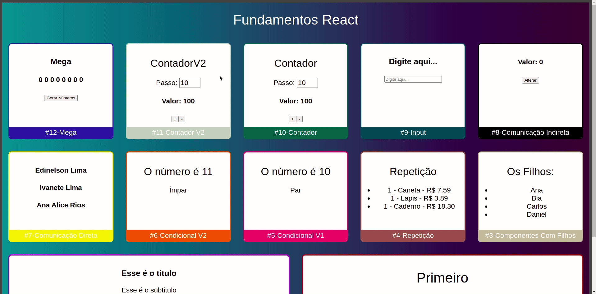

<h1 align="center"> Fundamentos do ReactJs #01 & #02 </h1> 


<hr>
<br>

## React JS Curso Rápido ⚛️ Masterclass #01 & #02
Foram duas aulas intensivas de ReactJs na qual foi repassados os conceitos fundamentais da tecnologia
* [Acesse a aula #01 aqui](https://www.youtube.com/watch?v=XQxitgyZ_S4&t=1541s)
* [Acesse a aula #02 aqui](https://www.youtube.com/watch?v=GJ8Vm-h0V8I)


## Dependências 
 - react: 17.0.2
 - react-dom: 17.0.2

## Inicie a aplicação
Primeiro, rode o comundo para instalar as dependências:

```bash
npm install
# or
yarn i
```
depois inicie normalmente com **npm run start** ou **yarn start**

Abra [http://localhost:3000](http://localhost:3000) com seu navegador parar ver a aplicação.
